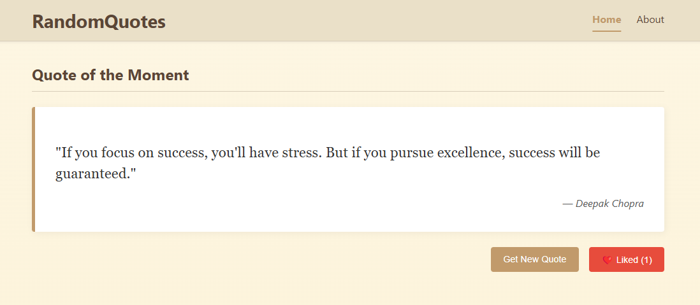

# 📚 Randomquotes - backend assignment (fullstack)

This is a full-stack web application that demonstrates a production-style quote service. It was built as part of a coding assignment to showcase software engineering skills across backend and frontend development, API integration, caching, reactive programming, and containerization.

The app fetches random inspirational quotes from external APIs and exposes them through a RESTful interface, with support for both JSON and XML responses. A modern React frontend displays the data to the user, and the application is packaged using Docker for seamless deployment.



---

## 🌟 Features

- ✅ **Random Quote Service**  
  Returns a new quote on every request from external APIs like [ZenQuotes](https://zenquotes.io/).

- ⚡ **High-Performance Caching**  
  Responses from external APIs are cached to reduce load time and improve responsiveness.

- 🔁 **Reactive Backend with Spring WebFlux**  
  Asynchronous, non-blocking architecture using Spring Boot, WebFlux, and R2DBC for a fully reactive stack.

- 🍪 **Anonymous User Tracking**  
  Users are identified using secure, HttpOnly browser cookies without requiring login.

- ❤️ **"Like" Functionality for Quotes**  
  Users can like quotes, and their preferences are stored in a PostgreSQL database with tracking via cookies.

- 🧩 **Resilient API Aggregation**  
  Handles API failures gracefully with a fallback mechanism for quote fetching.

- 🧪 **Content Negotiation**  
  Supports both JSON and XML responses depending on the `Accept` header.

- 🔄 _(Planned)_ **Real-time Streaming**  
  A live feed showing recently liked quotes, intended for future enhancement.

---

## 🧰 Tech Stack

- **Backend**: Java 21, Spring Boot, WebFlux, R2DBC, PostgreSQL
- **Frontend**: React (with TypeScript)
- **DevOps**: Docker, Maven
- **API Sources**: [ZenQuotes.io](https://zenquotes.io/)

---

## 🚀 Getting Started

### Prerequisites

- Java 21
- Node.js & npm
- Docker
- PostgreSQL

### Run with Docker Compose

In the **project root folder**, run the following commands:

```bash
docker-compose -f java-springboot-backend/docker-compose.backend.yml up -d --build
docker-compose -f spa-react-frontend/randomquotes.spa/docker-compose.frontend.yml up -d --build
```

This will spin up both the backend and frontend services in detached mode, building fresh images as needed.
Navigate to http://localhost:5000 to access the frontend.
The backend API is available at http://localhost:8080/api/v1/.

---

## 📦 API Endpoints

- `GET /api/quotes/random` — Returns a random quote
- `POST /api/quotes/{id}/like` — Like a quote
- `DELETE /api/quotes/{id}/like` — Unlike a quote
- Supports content negotiation: `Accept: application/json` or `application/xml`

---

## 📝 Notes

This project was designed to simulate real-world production code with a focus on:

- Clean architecture and modularity
- Resilience and fault tolerance
- Modern asynchronous programming patterns
- User-centric UX with anonymous personalization

---

## 📬 Feedback

This project is a demonstration of technical capabilities. Suggestions, pull requests, and constructive feedback are welcome!
